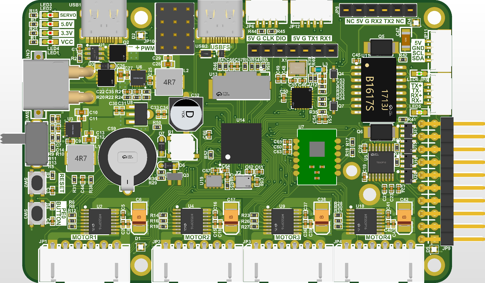

# ros2car_stm32h7

This is a project designed for small vehicle with high performance SLAM requirements.



## feature

### peripherals

* Texas Instrument DRV8874 DC motor driver support.
* ICM-42688-P IMU support.
* WS18B20 serial RGB LED support.
* STM32 ethernet and LAN8720-A ethernet PHY support.
* STM32 USB2.0 FS support.
* TF card support.
* RX8900-CE:UA0 external RTC support.
* PWM servo driver x4 support.
* External 0.96/1.3inch 7P OLED support.
* External bluetooth module support.
* External SBUS receiver support.
* External GNSS module support.

### system performance

* 4 x DC motor position, velocity, torque control with 6A peak current.
* ROS2 IMU and control message publish and subscribe via 100Mps Ethernet.
* multi-sensor(IMU, Lidar and camera) sync - trigger signals aligned to GMT+0800 second PPS.
* Camera STROBE signal detection and ROS2 message publishing of timestamp of CMOS exposure.
* GNSS time synchronization within 1000 nanoseconds offset.
* Hardware PTPv2 time synchronization within 100 nanoseconds offset.
* Log system with FATFS storage and visualization support.
* USB Mass storage + DFU + VCP.

### electrical specification

* 8 - 24V input; 5V 8A power supply for small computer; 5V 8A power supply for servos.
* ±30kV ESD per IEC 61000-4-2(Air) protection for external function pins.
* ±25kV ESD per IEC 61000-4-2(Contact) protection for external function pins.

## build

**prerequisite**

```bash
apt install cmake openocd gcc-arm-none-eabi
```

Install **STM32CubeCLT** and **STM32CubeMX**.
Install **STM32 VS Code Externsion** on Visual Studio Code.


This program is tested with:
1. x86_64 #53~22.04.1-Ubuntu GNU/Linux 6.8.0-52-generic
1. cmake version 3.22.1
2. arm-none-eabi-gcc 13.2.1 20231009 (Arm GNU Toolchain 13.2.rel1 (Build arm-13.7))
3. Open On-Chip Debugger 0.12.0+dev-00893-gf5dd564a7

**compile**

```
cmake -B build -DCMAKE_BUILD_TYPE=Debug && cmake --build build
```

**flash program**

```bash
openocd -f interface/stlink.cfg -f target/stm32h7x_dual_bank.cfg -c "program build/ros2car_stm32h7.elf reset exit"
```

**debug program**

Use VSCode debug tool to debug stm32 program. You can find the debug icon at the left side (default position) navigation bar.

## user guide

## contribute

Feel free to give a pull request. I'll be very thankful if you can help me solve the following todo tasks.

Thanks to these contributors:


## todo

- [x] Fix DRV8874 current sensing ADC issue.
- [ ] Adjust motor controller parameters.
- [ ] Fix ICM-42688-P SPI operation fault.
- [ ] Configure ICM-42688-P to generate data-ready signal.
- [ ] Add ICM-42688-P data-ready GPIO interrupt detection and IMU data reading.
- [ ] Add DC motor encoder round pulses auto-detection.
- [ ] Add external sensor trigger and camera strobe signal detection.
- [ ] Use ethernet MAC PPS output signal to align trigger signals.
- [ ] Fix ethernet communication.
- [ ] Test OLED driver.
- [ ] Refactor and test RX8900 real-time chip driver.
- [ ] Add Micro-XRCE-DDS ROS2 node.
- [ ] Add Micro-XRCE-DDS IMU message publisher.
- [ ] Add Micro-XRCE-DDS car control message subscriber.
- [ ] Design a new logger for variable monitoring and logging with different loggers.
- [ ] Add IEEE1588v2 time synchronization support.
- [ ] Add GNSS module driver.
- [ ] Add GNSS time synchronization for ethernet MAC timestamp.
- [ ] Configure USB driver to VCP+MSC+DFU classes.
- [ ] Add SD card FATFS support.
- [ ] Add power drop detection and file system saver in emergency.
- [ ] Add SBUS remote controller support.
- [ ] Add bluetooth module support (AT instructions)